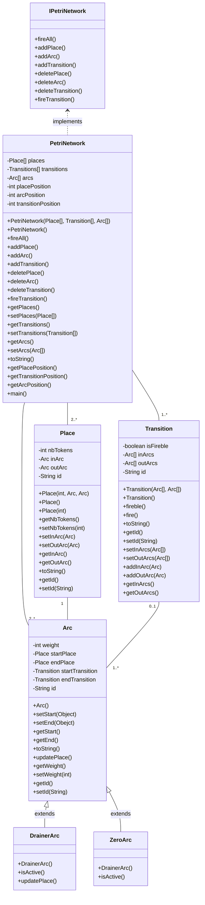

#UML Diagrams

## Actual State

```mermaid

classDiagram

   IPetriNetwork <.. PetriNetwork : implements
   PetriNetwork -- "2..*" Arc
   PetriNetwork -- "2..*" Place
   PetriNetwork -- "1..*" Transition

   Place "1" -- Arc
   Transition "0..1" -- "1..*" Arc

   Arc <|-- DrainerArc : extends
   Arc <|-- ZeroArc : extends

    class IPetriNetwork {
      +fireAll()
      +addPlace()
      +addArc()
      +addTransition()
      +deletePlace()
      +deleteArc()
      +deleteTransition()
      +fireTransition()
    }
    class PetriNetwork{
        -Place[] places
        -Transitions[] transitions
        -Arc[] arcs
        -int placePosition
        -int arcPosition
        -int transitionPosition
        +PetriNetwork(Place[], Transition[], Arc[])
        +PetriNetwork()
        +fireAll()
        +addPlace()
        +addArc()
        +addTransition()
        +deletePlace()
        +deleteArc()
        +deleteTransition()
        +fireTransition()
        +getPlaces()
        +setPlaces(Place[])
        +getTransitions()
        +setTransitions(Transition[])
        +getArcs()
        +setArcs(Arc[])
        +toString()
        +getPlacePosition()
        +getTransitionPosition()
        +getArcPosition()
        +main()
    }

    class Arc {
      -int weight
	    -Place startPlace
	    -Place endPlace
	    -Transition startTransition
	    -Transition endTransition
      -String id
      +Arc()
      +setStart(Object)
      +setEnd(Obejct)
      +getStart()
      +getEnd()
      +toString()
      +updatePlace()
      +getWeight()
      +setWeight(int)
      +getId()
      +setId(String)
    }

    class DrainerArc {
      +DrainerArc()
      +isActive()
      +updatePlace()
    }

    class ZeroArc {
      +DrainerArc()
      +isActive()
    }

    class Place {
        -int nbTokens
        -Arc inArc
        -Arc outArc
        -String id
        +Place(int, Arc, Arc)
        +Place()
        +Place(int)
        +getNbTokens()
        +setNbTokens(int)
        +setInArc(Arc)
        +setOutArc(Arc)
        +getInArc()
        +getOutArc()
        +toString()
        +getId()
        +setId(String)
    }

    class Transition {
      -boolean isFireble
      -Arc[] inArcs
      -Arc[] outArcs
      -String id
      +Transition(Arc[], Arc[])
      +Transition()
      +fireble()
      +fire()
      +toString()
      +getId()
      +setId(String)
      +setInArcs(Arc[])
      +setOutArcs(Arc[])
      +addInArc(Arc)
      +addOutArc(Arc)
      +getInArcs()
      +getOutArcs()
    }

```