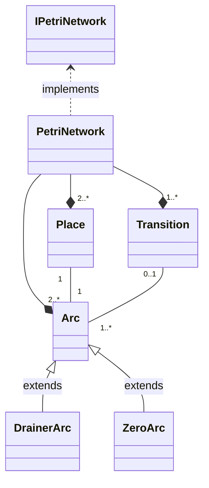
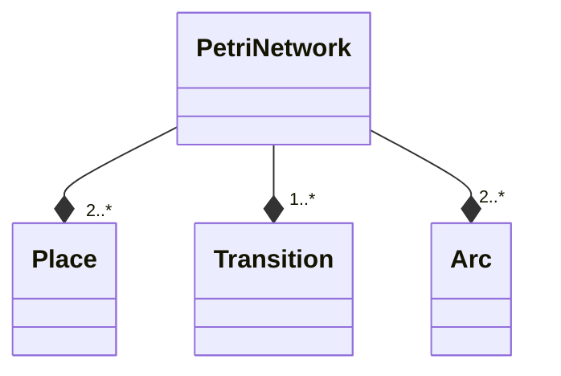
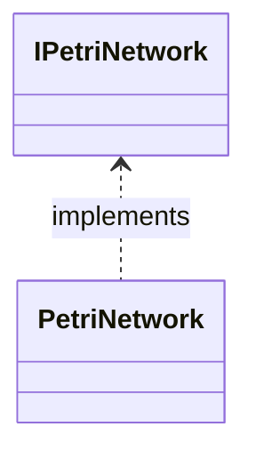
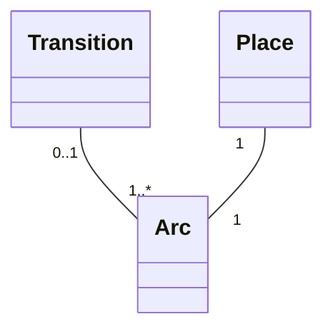
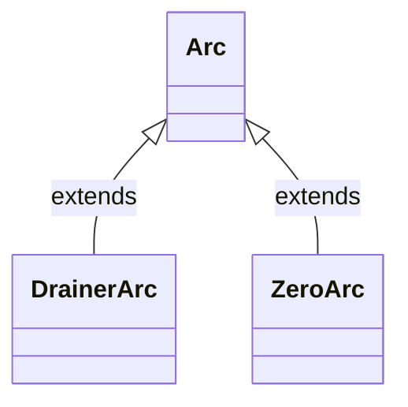

# UML Diagrams

## Actual State UML view

```mermaid

classDiagram

   IPetriNetwork <.. PetriNetwork : implements
   PetriNetwork --* "2..*" Arc
   PetriNetwork --* "2..*" Place
   PetriNetwork --* "1..*" Transition

   Place "1" -- "1" Arc
   Transition "0..1" -- "1..*" Arc

   Arc <|-- DrainerArc : extends
   Arc <|-- ZeroArc : extends

    class IPetriNetwork {
      +fireAll()
      +addPlace()
      +addArc()
      +addTransition()
      +deletePlace()
      +deleteArc()
      +deleteTransition()
      +fireTransition()
    }
    class PetriNetwork{
        -Place[] places
        -Transitions[] transitions
        -Arc[] arcs
        -int placePosition
        -int arcPosition
        -int transitionPosition
        +PetriNetwork(Place[], Transition[], Arc[])
        +fireAll()
        +addPlace()
        +addArc()
        +addTransition()
        +deletePlace()
        +deleteArc()
        +deleteTransition()
        +fireTransition()
        +getPlaces()
        +getTransitions()
        +getArcs()
        +toString()
        +getPlacePosition()
        +getTransitionPosition()
        +getArcPosition()
        +main()
    }

    class Arc {
      -int weight
	    -Place startPlace
	    -Place endPlace
	    -Transition startTransition
	    -Transition endTransition
      -String id
      +Arc()
      +setStart(Object)
      +setEnd(Obejct)
      +getStart()
      +getEnd()
      +toString()
      +updatePlace()
      +getWeight()
      +setWeight(int)
      +getId()
      +setId(String)
    }

    class DrainerArc {
      +DrainerArc()
      +isActive()
      +updatePlace()
    }

    class ZeroArc {
      +DrainerArc()
      +isActive()
    }

    class Place {
        -int nbTokens
        -Arc inArc
        -Arc outArc
        -String id
        +Place(int, Arc, Arc)
        +Place()
        +Place(int)
        +getNbTokens()
        +setNbTokens(int)
        +setInArc(Arc)
        +setOutArc(Arc)
        +getInArc()
        +getOutArc()
        +toString()
        +getId()
        +setId(String)
    }

    class Transition {
      -boolean isFireble
      -Arc[] inArcs
      -Arc[] outArcs
      -String id
      +Transition(Arc[], Arc[])
      +Transition()
      +fireble()
      +fire()
      +toString()
      +getId()
      +setId(String)
      +setInArcs(Arc[])
      +setOutArcs(Arc[])
      +addInArc(Arc)
      +addOutArc(Arc)
      +getInArcs()
      +getOutArcs()
    }

```

### Simplified UML view

## Explanations 
### Composition between Ar, Tr, Pl and the Petri net

In a Petri net Java project, having arcs, transitions, and places as compositions of the PetriNet class enhances code organization and encapsulation. For instance, Arcs, Places and Transitions can't exist without a Petri net, then, whenever this Petri net is deleted, all of this objects should also be deleted. 

This design choice promotes a modular structure, allowing the PetriNet class to centrally manage and coordinate the behavior of arcs, transitions, and places, leading to a more maintainable and comprehensible implementation.

### PetriNet class implements IPetriNet interface

In the PetriNet Java project, implementing an interface named `IPetriNet` serves to abstract and standardize the essential functionalities of a Petri net.

This abstraction provides a clear contract for classes that implement the interface, ensuring a consistent and interchangeable usage of different Petri net implementations. The use of an interface also enhances code flexibility and extensibility, allowing for the seamless integration of new classes representing variations of Petri nets without disrupting existing code. 

Furthermore, by employing polymorphism through the interface, objects of different classes that implement `IPetriNet` can be treated interchangeably, fostering a more adaptable and generic codebase. Overall, the introduction of the `IPetriNet` interface contributes to a well-organized and extensible design.

### Link between Ar, Pl and Tr

In the context of a Petri net Java project, establishing a link relation between arcs, transitions, and places is crucial for accurately representing the network's structure and facilitating seamless interactions. 

The defined link relation, as illustrated by the provided Mermaid diagram, signifies that a transition may be connected to zero or one arc, while an arc is associated with one or more transitions. Similarly, a place is connected to one arc. 

This relational model enforces the inherent dependencies and flow of tokens within the Petri net, allowing for a precise and intuitive representation of how transitions interact with arcs and places. Implementing such a link relation ensures a consistent and standardized structure, contributing to the clarity and maintainability of the Petri net implementation in the Java project.

### DrainerArc and ZeroArc extend Arc

DrainedArc can represent arcs that have been depleted of tokens, allowing for a more nuanced depiction of the Petri net's dynamic state. 

On the other hand, ZeroArc can signify arcs associated with transitions that require input but have not yet received any tokens. These specialized classes provide a means to differentiate between various arc states, offering a more detailed and expressive representation of the token flow within the Petri net. 

By introducing DrainedArc and ZeroArc, the code becomes more modular, enabling specific behaviors and conditions to be associated with each arc type.