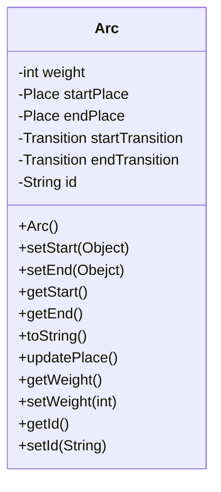

# Classes
## Arc



We chose to use dynamic functions to set the Object in the start (`setStart`) or in the end (`setEnd`) of the Arc. Retrieving to the attributes `startPlace`, `endPlace`, `startTransition` or `endTransition`, is mandatory for the Arc to have only one object in each side, wheather it is a Place or a Transition.

```Java
public void setStart(Object start) throws ExistingObjectException {
  
  if (this.startPlace != null || this.startTransition != null) {
    throw new ExistingObjectException();
    
  } else if (start.getClass() == Place.class) {
    this.startPlace = (Place) start;
    
  } else if (start.getClass() == Transition.class) {
    this.startTransition = (Transition) start;
  }
};
```

This versatility was also used on constructing the methods `getEnd` and `getStart`, one time that they can retrieve a `Place` or a `Transition`.

```Java
public Object getStart() throws NoExistingObjectException {
  
  if (this.startTransition == null && this.startPlace == null) {
    throw new NoExistingObjectException();
  };
  
  if (this.startPlace != null) {
    return this.startPlace;
  } else {
    return this.startTransition;
  }
};
```
