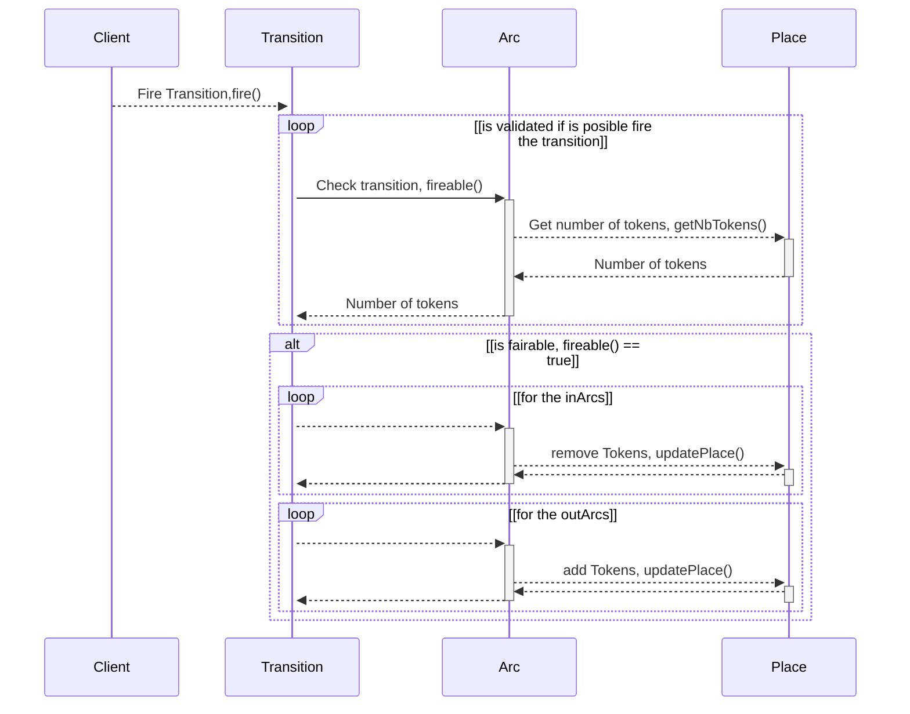

# Sequence Diagram

A Petri net sequence diagram illustrates the dynamic behavior of a Petri net by showing the sequence of transitions and their firing in response to input events or conditions. Each transition in the diagram represents a state change in the system, and the directed arcs connecting transitions to places indicate the flow of tokens, which are used to model resources or conditions. This visual representation helps to understand the temporal sequence of events and transitions within a Petri net, making it a valuable tool for modeling and analyzing complex, concurrent processes.

